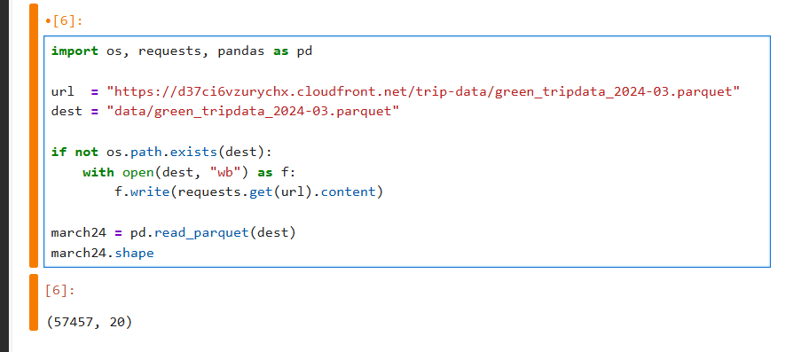
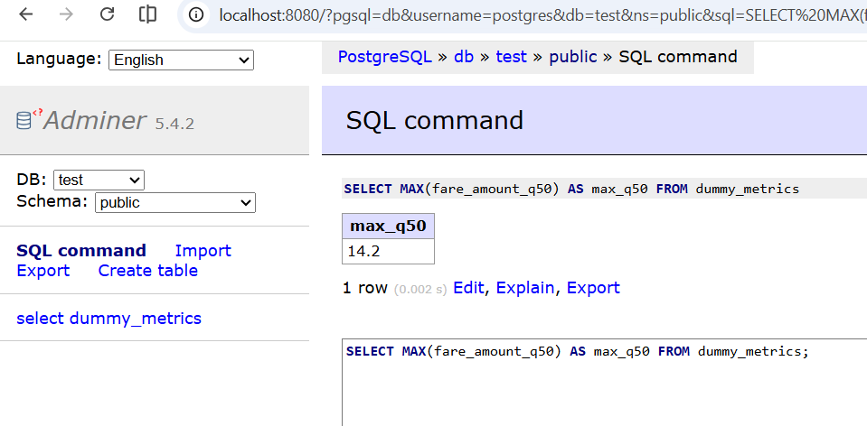
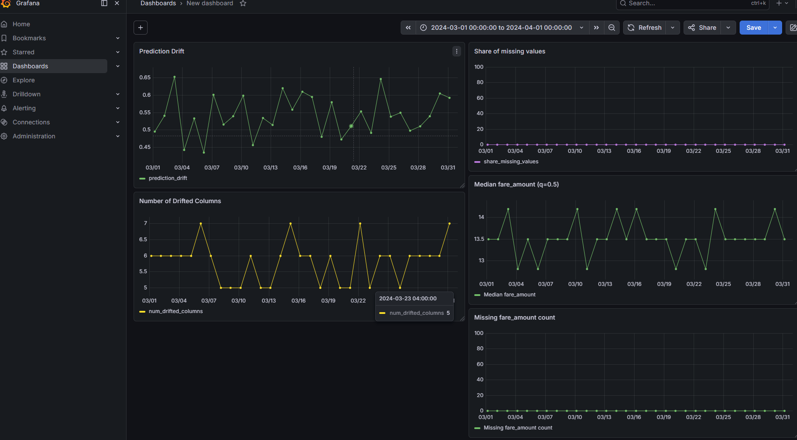

# Homework 5 — Model Monitoring

Module: [05-monitoring](../../05-monitoring/post-evidently-0.7/) (using the `post-evidently-0.7` example)

## Q1. Prepare the dataset

Downloaded `green_tripdata_2024-03.parquet` and read it with pandas.

`march24.shape` → **(57457, 20)**

**Answer: 57457**



## Q2. Metric

Added two metrics for the `fare_amount` column:

- `QuantileValue(column='fare_amount', quantile=0.5)` — required by the hint
- `MissingValueCount(column='fare_amount')` — my chosen extra metric

> Note: in Evidently 0.7+ the quantile metric is `QuantileValue`, not the legacy `ColumnQuantileMetric` mentioned in the hint.

```python
from evidently.metrics import QuantileValue, MissingValueCount

report = Report(metrics=[
    ValueDrift(column='prediction'),
    DriftedColumnsCount(),
    MissingValueCount(column='prediction'),
    QuantileValue(column='fare_amount', quantile=0.5),   # required by hint
    MissingValueCount(column='fare_amount'),             # my chosen extra metric
])
```

**Answer: `MissingValueCount` (on `fare_amount`)**

## Q3. Monitoring

Ran the modified `evidently_metrics_calculation.py` over March 2024 Green Taxi data (31 daily batches). The `QuantileValue(column='fare_amount', quantile=0.5)` value was stored in the `fare_amount_q50` column of `dummy_metrics`. Queried max via Adminer:

```sql
SELECT MAX(fare_amount_q50) AS max_q50 FROM dummy_metrics;
-- max_q50 = 14.2
```

**Answer: 14.2**



## Q4. Dashboard

Added two new Grafana panels for the metrics introduced in Q2:

- **Median fare_amount (q=0.5)** — line chart of `fare_amount_q50` over March 2024.
- **Missing fare_amount count** — line chart of `fare_amount_missing` (flat at 0 — no missing fares in the dataset).

Exported the dashboard JSON and saved it under [`05-monitoring/post-evidently-0.7/dashboards/nyc_taxi_data_quality.json`](../../05-monitoring/post-evidently-0.7/dashboards/nyc_taxi_data_quality.json) (alongside the upstream `data_drift.json`). Docker-compose mounts that folder into Grafana at `/opt/grafana/dashboards`, so the dashboard reloads from there on container restart.

**Answer: `project_folder/dashboards` (i.e. `05-monitoring/dashboards`)**


