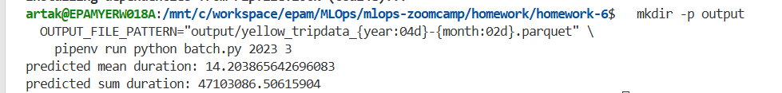
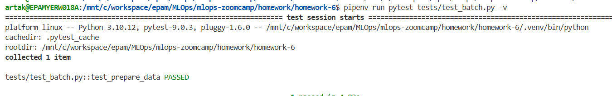
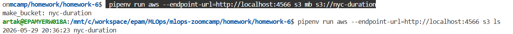
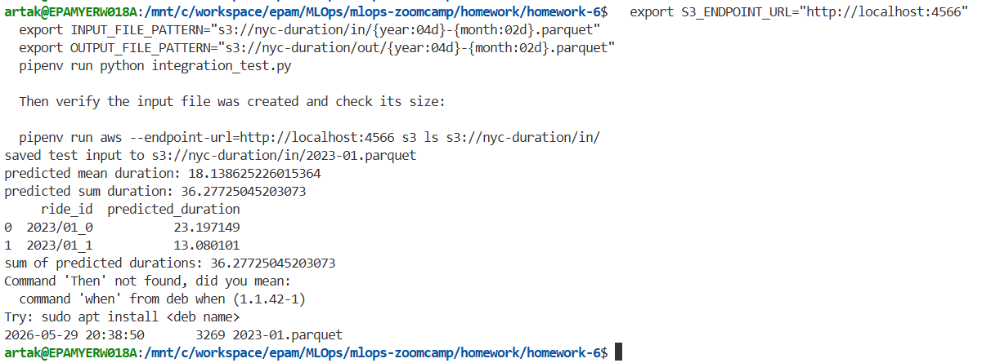

## Q1. Refactoring

Refactored `batch.py`: created `main(year, month)`, moved everything except `read_data`
inside it, made `categorical` a parameter of `read_data`, and added the main block.
Verified it still works by running it for **March 2023** (output written to the local
filesystem):

```bash
OUTPUT_FILE_PATTERN="output/yellow_tripdata_{year:04d}-{month:02d}.parquet" \
  pipenv run python batch.py 2023 3
# predicted mean duration: 14.203865642696083
```

**Answer: `if __name__ == '__main__':`**



## Q2. Installing pytest

Installed pytest into the dev group (`pipenv install --dev pytest`) and created a `tests`
folder with `test_batch.py`. The second file required is the package marker so `batch.py`
can be imported by the test.

**Answer: `__init__.py`**

## Q3. Writing first unit test

Split the transformation logic out of `read_data` into a pure `prepare_data(df, categorical)`
function, then tested it with the assignment's input. Only two rows survive the
`1 <= duration <= 60` filter:

- row 0 → 9 min ✅
- row 1 → 8 min ✅
- row 2 → 59 sec ❌ (< 1 min)
- row 3 → 60 min 1 sec ❌ (> 60 min)

```bash
pipenv run pytest tests/test_batch.py -v
# 1 passed
```

**Answer: `2`**



## Q4. Mocking S3 with Localstack

Ran Localstack (S3 only) via `docker-compose.yaml`, created the `nyc-duration` bucket and
listed it. For both commands we point the AWS CLI at Localstack with the endpoint option.

```bash
docker-compose up -d
aws --endpoint-url=http://localhost:4566 s3 mb s3://nyc-duration
aws --endpoint-url=http://localhost:4566 s3 ls
```

**Answer: `--endpoint-url`**



## Q5. Creating test data

Made input/output paths configurable via `INPUT_FILE_PATTERN` / `OUTPUT_FILE_PATTERN`, and
made `read_data`/`save_data` use `S3_ENDPOINT_URL` when set. `integration_test.py` builds the
Q3 dataframe (pretending it's January 2023) and saves it to Localstack S3, then we check the
file size with the AWS CLI.

```bash
pipenv run python integration_test.py   # saves s3://nyc-duration/in/2023-01.parquet
aws --endpoint-url=http://localhost:4566 s3 ls s3://nyc-duration/in/
```

Actual size produced here was **3269 bytes**; the closest listed option is `3620`.

**Answer: `3620` (closest option)**



## Q6. Finish the integration test

Added `save_data` (mirror of `read_data` for writing), then `integration_test.py` runs
`batch.py` for January 2023 via `os.system`, reads the predictions back from Localstack, and
sums `predicted_duration`. The whole flow is wrapped in `integration_test.sh`.

```bash
pipenv run python integration_test.py
# predicted durations: 23.20 + 13.08
# sum of predicted durations: 36.27725045203073
```

The end-to-end flow is also wrapped in `integration_test.sh` (localstack up → bucket →
`integration_test.py` → tear down).

**Answer: `36.28` (closest option)**


